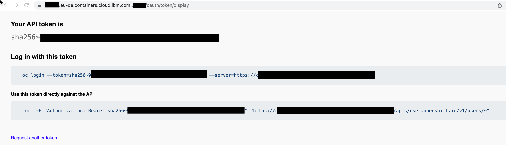

# Iascable-and-reuse-existing-resources-boms

This project does verify how the usage iascable and reuse of existing environments works with BOMs. 

## Objective

The objective is to reuse existing cloud resources in this example we will an OpenShift cluster.

## How to handle variable input

First let us have a look how to handle the input of the variables we need to use when we create new Terraform code with iascable.

You can use following [blog post to login to you IBM Cloud Red Hat OpenShift cluster using the Red Hat OpenShift CLI](https://suedbroecker.net/2021/11/15/log-in-to-the-an-ibm-cloud-red-hat-openshift-cluster-using-the-ibm-cloud-and-oc-cli%c2%b6/).

> You can get the needed login values by using `"Copy ling command"` in the OpenShift UI.



### 1. Approach to use variable in a BOM

Example the [terraform-opc-login](https://github.com/cloud-native-toolkit/terraform-ocp-login)

```yaml
apiVersion: cloudnativetoolkit.dev/v1alpha1
kind: BillOfMaterial
metadata:
  name: example
spec:
  modules:
  - name: ocp-login
    alias: ocp-login
    version: v1.6.0
    variables:
      - name: server_url
        value: "https://YOUR_SERVER_URL"
      - name: login_user
        value: IAM#[YOURID]/[YOUR_SERVER_URL]
      - name: login_token
        value: XXX
```


### 2. Approach to use variables in a credentials file

In that case we have two files the BOM file and the `credentials` file.

* Credenticials file `credentials.properties`

```sh
export TF_VAR_server_url=https://YOUR_SERVER_URL
export TF_VAR_login_user=IAM#[YOURID]/[YOUR_SERVER_URL]
export TF_VAR_login_token=XXX
```

* BOM file

```yaml
apiVersion: cloudnativetoolkit.dev/v1alpha1
kind: BillOfMaterial
metadata:
  name: example
spec:
  modules:
  - name: ocp-login
```

### Verify the two options

You can follow the [blog post to setup the local environment with Multipass](https://suedbroecker.net/2022/09/08/using-multipass-to-run-a-tools-virtual-machine/)

#### Option 1

##### Step 1: Navigate to the `example/01` folder

```sh
cd example/01
```

##### Step 2: Execute the `iascable` command

```sh
iascable build -i example-variable-bom.yaml
```
