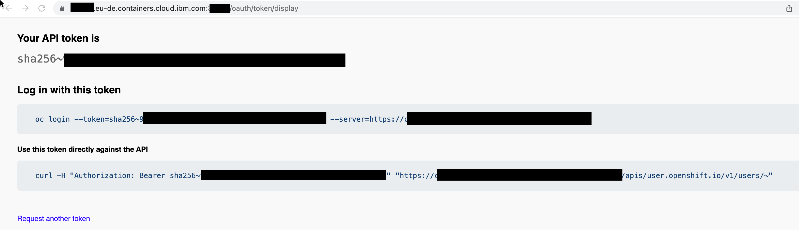

# Iascable-and-reuse-existing-resources-boms

This project does verify how the usage iascable and reuse of existing environments works with BOMs. 

## 1. Objective

The objective is to reuse existing cloud resources in this example we will an OpenShift cluster.

## 2. How to handle variable input

First let us have a look how to handle the input of the variables we need to use when we create new Terraform code with iascable.

You can use following [blog post to login to you IBM Cloud Red Hat OpenShift cluster using the Red Hat OpenShift CLI](https://suedbroecker.net/2021/11/15/log-in-to-the-an-ibm-cloud-red-hat-openshift-cluster-using-the-ibm-cloud-and-oc-cli%c2%b6/).

> You can get the needed login values pressing the button `"Copy login command"` in the OpenShift UI.



### 1. Approach to use variable in a BOM

Example the [terraform-opc-login](https://github.com/cloud-native-toolkit/terraform-ocp-login)

```yaml
apiVersion: cloudnativetoolkit.dev/v1alpha1
kind: BillOfMaterial
metadata:
  name: example
spec:
  modules:
  - name: ocp-login
    alias: ocp-login
    version: v1.6.0
    variables:
      - name: server_url
        value: "https://YOUR_SERVER_URL"
      - name: login_user
        value: IAM#[YOURID]/[YOUR_SERVER_URL]
      - name: login_token
        value: XXX
```


### 2. Approach to use variables in a credentials file

In that case we have two files the BOM file and the `credentials` file.

* Credenticials file `credentials.properties`

```sh
export TF_VAR_server_url=https://YOUR_SERVER_URL
export TF_VAR_login_user=IAM#[YOURID]/[YOUR_SERVER_URL]
export TF_VAR_login_token=XXX
```

* BOM file

```yaml
apiVersion: cloudnativetoolkit.dev/v1alpha1
kind: BillOfMaterial
metadata:
  name: example
spec:
  modules:
  - name: ocp-login
```

## 3 Verify the two options

You can follow the [blog post to setup the local environment with Multipass](https://suedbroecker.net/2022/09/08/using-multipass-to-run-a-tools-virtual-machine/)

### 3.1 Option 1

#### 3.1.1 Terminal in the local machine 

##### Step 1: Navigate to the `example/01` folder

```sh
cd example/01
```

##### Step 2: Edit the BOM and then execute the `iascable` command

* `BOM` 

```sh
nano ./example-variable-bom.yaml
```

* Execute iascable

```sh
iascable build -i example-variable-bom.yaml
```

##### Step 3: Navigate to the `output` folder

```sh
cd output
```

##### Step 4: Map the current `output` folder to the running Multipass `cli-tools VM` 

Ensure you started the `Multipass cli-tools VM` before you execute the following command:

```sh
multipass mount $PWD cli-tools:/automation
```

#### 3.1.2 Terminal inside the `cli-tools VM`

Now we have mapped the `output` folder to the `cli-tools VM`. We can use the installed [`CLI tools`](https://github.com/cloud-native-toolkit/image-cli-tools) inside the `cli-tools VM` to apply the Terraform code. 

> All changes we made in with `cli-tools VM` will be save in the map folder on our local machine.

##### Step 1: Open the interactive shell

```sh
multipass shell cli-tools
```

##### Step 2: Navigate to the automation folder

```sh
cd ../../automation
ls
```

##### Step 3: Now navigate to the `example` folder

```sh
cd example/
ls
```

##### Step 4: Execute apply.sh

```sh
sh apply.sh
```

##### Step 5: Enter `yes` to apply the Terraform code

```sh
Do you want to perform these actions?
  Terraform will perform the actions described above.
  Only 'yes' will be accepted to approve.

  Enter a value:
```

##### Step 6: Now you should see the following output

```sh
Apply complete! Resources: 2 added, 0 changed, 0 destroyed.
```

### 3.2 Option 2

#### 3.2.1 Terminal in the local machine 

##### Step 1: Navigate to the `example/02` folder

```sh
cd example/02
```

##### Step 2: Create a `credentials.properties` file and edit the file

* Copy

```sh
cp ./credentials.properties-template ./credentials.properties
```

* Edit

```sh
nano ./credentials.properties
```

##### Step 3: Execute the `iascable` command

```sh
iascable build -i example-cred-bom.yaml
```

##### Step 4: Navigate to the `output` folder

```sh
cd output
```

##### Step 5: Copy the `credentials.properties` into the `output` folder

```sh
CURRENT_PATH=$(pwd)
cp $CURRENT_PATH/../credentials.properties $CURRENT_PATH/credentials.properties
```

##### Step 6: Map the current folder to the Multpass cli-tools VM

Ensure you started the `Multipass cli-tools VM` before you execute the following command:

```sh
multipass mount $PWD cli-tools:/automation
```

#### 3.1.2 Terminal inside the `cli-tools VM`

Now we have mapped the `output` folder to the `cli-tools VM`. We can use the installed [`CLI tools`](https://github.com/cloud-native-toolkit/image-cli-tools) inside the `cli-tools VM` to apply the Terraform code. 

> All changes we made in with `cli-tools VM` will be save in the map folder on our local machine.


#### Step 1: Open the interactive shell

```sh
multipass shell cli-tools
```

#### Step 2: In the virtual machine navigate to the automation folder

```sh
cd ../../automation
ls
```

#### Step 3: Source the `credentials.properties` as environment variables and show one variable

```sh
source credentials.properties
echo $TF_VAR_login_user
```

#### Step 4: Now navigate to the `example` folder

```sh
cd example/
ls
```

#### Step 5: Execute apply.sh

```sh
sh apply.sh
```

#### Step 6: Enter `yes` to apply the Terraform code

```sh
Do you want to perform these actions?
  Terraform will perform the actions described above.
  Only 'yes' will be accepted to approve.

  Enter a value:
```

#### Step 7: Now you should see the following output

```sh
Apply complete! Resources: 2 added, 0 changed, 0 destroyed.
```